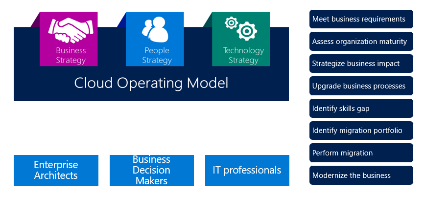
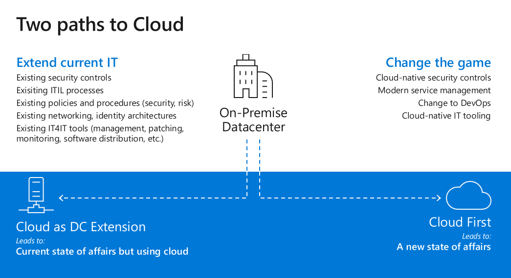
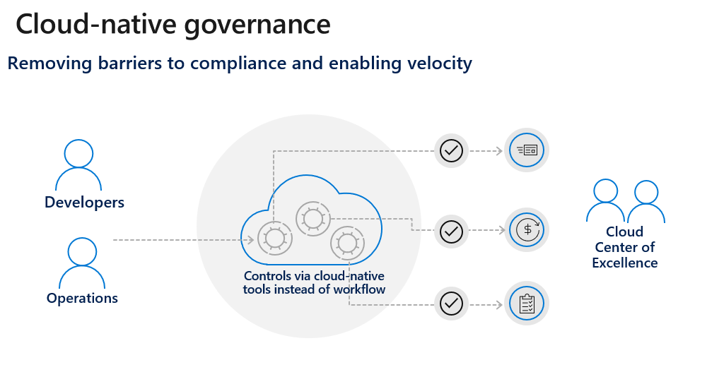
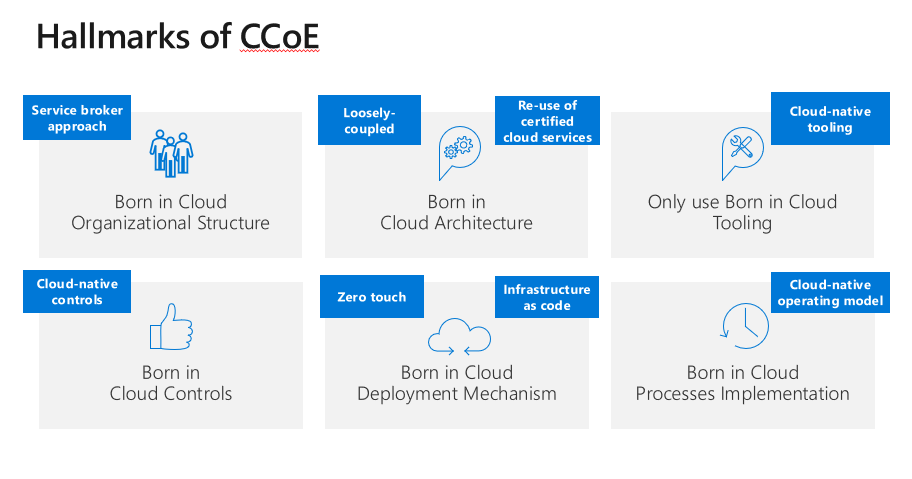
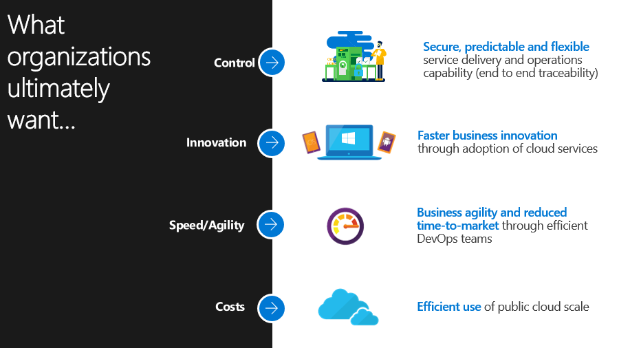
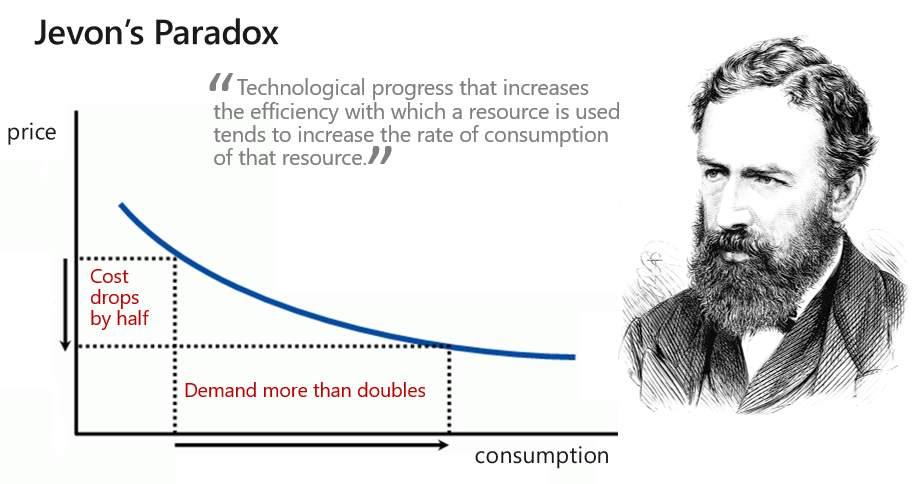

Azure Governance Foundations Introduction 
==========================================

Contents:
---------

-   [The need for governance](#the-need-for-governance)

-   [The Cloud Adoption Framework](#the-cloud-adoption-framework)

-   [Executive Summary](#executive-summary-of-a-cloud-center-of-excellence)

-   [History](#history)

-   [A new Approach](#a-new-approach-to-an-old-problem)

-   [Cloud First](#cloud-first)

-   [It’s Culture not Cloud](#what-is-a-ccoe)

-   [What is a CCoE](#what-is-a-ccoe)

-   [Do I need Azure Governance
    Foundations?](#do-i-need-the-azure-governance-foundations)

The need for governance
-----------------------

The characteristics of the public cloud - agility, flexibility, and
consumption-based pricing - are of paramount importance to organizations that
need to move quickly. Historically enterprise IT, while trying to ensure that
systems are effectively governed and secured, were often seen as slow to react
and in the most extreme cases as draconian in their approach.

This gave rise to the notion (in some cases a misconception) that the time and
effort of creating a comprehensive governance system and its accompanying
bureaucracy would slow the business down to the point where it would negate any
gains realized from using the cloud. As such, some groups within businesses
ended up going directly to cloud providers without involving enterprise IT. The
practice was in fact so widespread it was given the name “Shadow IT” by the
industry.

When we look at enterprises who have successfully moved to the cloud, we find
that they typically address the topic of governance early to ensure the
effective use of the cloud within the enterprise. They have a general approach
of building and securing their cloud before anyone can use it. A common analogy
used among these organizations is “building the house” before letting anyone
occupy it.

To follow the analogy of a house being built (where a well-governed cloud is the
outcome) we need to make use of scaffolding to secure our structures. The
scaffold provides the general outline and boundaries for future features to be
added. An enterprise cloud scaffold is much the same: a set of flexible controls
and cloud capabilities that provide structure to the environment, sets
perimeters and provides and anchors for services built on the public cloud.
Scaffolding provides a foundation to create and attach new services keeping
speed of delivery in mind.

The enterprise scaffold is intended to be the foundation of cloud environments.
It enables administrators to ensure workloads meet the minimum governance
requirements of an organization while allowing business groups and developers to
quickly meeting their own goals.

Contrary to the opinions that led to the rise of Shadow IT, our experience shows
that foundational governance efforts greatly speed, rather than impede, cloud
growth.

How an enterprise implements this scaffolding and governance varies but the
purpose of the Azure Governance Foundations (AGF) is to provide a concrete
approach to this effort.

One approach that successful customers have implemented is the creation of a
Cloud Center of Excellence (CCoE). The CCoE is comprised of teams of very
specialized personnel who focus on cloud governance and management. The idea of
a CCoE is one of a modern IT operational model that that follows an agile
approach to capturing business requirements to partner with the business. The
goal of the AGF is to help customers create a functional CCoE that provided
agility, governance and security to the business.

The Cloud Adoption Framework
----------------------------

Cloud Operating Model (COM) helps organizations with a simplified cloud adoption
journey with Microsoft Azure. It contains detailed information to cover an
end-to-end cloud adoption journey, starting from assessing cloud readiness, to
defining business and technology strategy. It contains a framework to
strategize, plan, migrate, and optimize infrastructure for Microsoft Azure.

If you haven’t yet read this document, it is strongly encouraged you do so now.
The AGF approach is predicated on the COM and understanding the context it
provides is important and valuable.

The COM provides a comprehensive look at how enterprises might plan, migrate,
and optimize infrastructure in the cloud and focuses on these through three
strategy lenses, Business, People and Technology. The lion’s share of the
content is, not surprisingly, focused on the technology strategy. In reading
through the document you may have felt that the topic of people was somewhat
brief (2 pages out of the 69 total pages).

The COM describes the creation of a Cloud Strategy Team (CST) consisting of
business leaders, finance, IT infrastructure, and application groups. These
teams can help with the cloud analysis and experimentation phase.

The Azure Governance Foundations provides guidance for the next phase in that
journey. The AGF is here to answer the questions of “what happens after the
analysis and experimentation are completed? and Where do I go from here?”

Executive Summary 
------------------

The CCoE is an evolution of the traditional, legacy IT model operated on-premise
and in customer own datacenters. While the traditional IT model may have served
organizations well, it also had a number of limitations. These limitations were
driven by traditional ITs need both to acquire hardware and to install any
accompanying software. This effort typically created siloed organizations within
IT where each silo managed its own parochial needs. The introduction of public
clouds and in particular, the need for Agile software development meant that
siloed organization such as these created barriers to developing an efficient
public cloud offering.

The CCoE is first and foremost the transformation from IT being an intermediary
for strategy, design and operation (a man-in-the-middle role) to becoming a
partner with the business and adds value as a broker to business providing
knowledge and experience around the evolving technology landscapes that cloud
creates.

The CCoE helps customers build a modern IT organization that follows an agile
approach and follows cloud-native principles like using reusable deployment
packages that align with security, compliance, and service management policies;
and maintaining a functional cloud platform that aligns with operational
procedures. The CCoE utilizes DevOps principles combined with cloud native
service management and security controls to empower IT to deliver products and
services with speed, agility, and control.

Enterprises are increasingly adopting the public cloud for its agility and
flexibility. They utilize the cloud's strengths to generate revenue and optimize
resource usage for the business. Microsoft Azure provides a multitude of
services and capabilities that enterprises assemble like building blocks to
address a wide array of workloads and applications.

History
-------

As mentioned in the introduction, enterprise IT departments, while trying to
ensure that systems are effectively governed and secured, were often seen as
slow to react and in the most extreme cases as draconian in their approach.

Why was the that the case?

Traditionally IT departments were concerned with the infrastructure in their
datacenter. Whether that datacenter was thousands of square feet of raised floor
and rows of racks or just an office (sometimes even a closet) with a mix of
gear. The IT department was responsible for all of it – from purchasing it, to
racking and stacking the equipment, not to mention networking, power, cooling
and of course maintenance and patching. It was a challenging responsibility and
IT departments needed to exact strong control measures on the systems they had
as well as the process for acquiring new systems. Someone had to consider the
footprint, power consumption and other aspects of adding new hardware.

Generally speaking, making changes to existing systems or adding new systems
were a time-consuming effort. Change tickets needed to be created,
authorizations provided, systems updated and ultimately personnel sent to
address the request.

As virtualization software became mainstream this process was simplified
somewhat and generally accounted for an improvement in the time to fulfill
requests. IT departments would tend to overprovision their hypervisor hosts with
more compute and memory than was currently required (rather than rightsizing the
hardware to meet the current request) with the understanding that the business
would grow into that additional capacity. In this way they could use software
defined computing to carve out “virtual machines” from the hardware and
provision them. Likewise, they could also overcommit the hosts they had adding
more virtual machines than should be possible, based on their paper
requirements. This was possible by virtue of the hypervisor software and the
fact that virtual machines rarely used all the resources that they were spec’d
to require.

But even with the improvements brought about by virtualization and software
defined resources (compute, network typically) the process to request a new
virtual machine did not improve commensurate with the technology. Legacy
systems, intrenched processes and a lack of automation in IT service management
continued to plaque many companies.

Enter the world of cloud. The earliest days of the cloud were marked by a
frustration with the speed and service offered by IT departments (a problem that
persists in some organizations). Business units would find that the IT
departments simply moved too slowly either in fulfilling requests, be that for
new virtual machines or in acquiring new hardware. In frustration, they would go
directly to cloud providers and sign up for the services they wanted, getting
access to these services in just a few minutes (where IT might take days, weeks
or even longer). And so “Shadow IT” was born.

Shadow IT left the enterprise IT in an extremely difficult situation. IT is
tasked with keeping the organization’s systems, networks and data secured but
they might not even know about the existence of these Shadow IT systems and if
they did know of them, they might not have access to them.

Obviously, this was a situation that could not be allowed to continue. In a
world where GDPR and other regulatory requirements create steep fines and
penalties, IT departments needed to regain control. And so companies began to
adopt cloud more broadly (and sometimes reluctantly) and offer the business
cloud services the need for Shadow IT has diminished to a degree. But how would
IT manage a cloud with infinite capacity? A cloud where users might spin up
hundreds of machines accidently or otherwise, was a cloud that presented the IT
department with a new set of problems. Even if they could control the costs, how
would they secure the systems? Assure good governance? Monitor the health of
these services?

A common approach is to take the existing model from their on-premise
datacenters and apply this to the cloud. The IT department asserts control by
acting as a cloud custodian using a man-in-the-middle approach. All request for
cloud resources go through the cloud custodian.

While this approach returns control back to the IT department, it also greatly
reduces the value of the cloud to bring speed and agility to the organization.
The approach works but at the cost of reducing the true potential of the cloud.

A new approach to an old problem
--------------------------------

As described above, the perception of IT departments as slow, cumbersome and
sometimes draconian are not baseless but, in fairness, the reasons that these
management practices arose were reasonable reactions to a changing technology
landscape.

Still there has to be a better approach to cloud than stopping everyone who has
a request for cloud services and forcing them through a provisioning process.
The cloud custodian can only manage a fixed number of requests, if the company
requires more cloud resources than the custodian can manage, the requests sit
idle. The longer the requests sit idle the more the requestor might be lured
back into the Shadow IT world.

#### A better approach than stopping every request and manually addressing it would be a system where requests can be self-service but also one where they are automatically provisioned in a manner that meets the corporate governance, security and compliance requirements.

Think of it as a round-about (or traffic circle) where request can come through,
be addressed safely and without needing to stop. “Guardrails” are in place to
ensure that the requests do not go “off the road”.

In theory this sounds wonderful. No one slows down, and all the corporation’s
requirements are also met. But in practice, this is not a common approach today.
Part of the reason for this is that many of the cloud-native tools that afford
this approach are relatively new. In fact, the entire AGF approach is predicated
on a few technological requirements that the cloud must provide. These are the
mechanisms to enforce policies on new requests and either reject those that
don’t comply or modify the resulting service in such a way that it will be in
compliance. In the case of Azure, these mechanisms are Azure Policies,
Management Groups and Azure Blueprints. Absent these mechanisms, new requests
would need to pass through a dizzying number of scripts (all of which would need
to be created and maintained) in order to enact some similar degree of control.
By taking advance of the controls the cloud natively provides we can govern in a
“cloud first” model with relative ease.

Cloud First
-----------

The term “Cloud First” is becoming widely used in the industry and so it is
worth taking a moment to define it here in the context of AGF.

Cloud first refers to a mindset where cloud is the de facto platform, rather
than an option or an afterthought. In 2010 Steve Ballmer, Microsoft’s then-CEO,
famously said that “We’re all in.” with respect to cloud computing. That quote,
while commonly associated with playing poker (certainly such a move was
considered a gamble by some at the time) also meant that every aspect of
Microsoft would begin to think about cloud first, rather than the traditional
enterprise datacenter that had been the mainstay of the company’s fortunes.

Cloud first is sometimes used interchangeably with “Cloud Native” but for the
purposes of the AGF we will delineate them. Cloud native describes organizations
that were created during the cloud era, and so their behaviors are naturally
cloud first. These organizations did not need to transform from a datacenter
model to a cloud model -often giving them a tremendous advantage.

A company that is cloud first understands that when software is developed and
deployed, cloud *is* the destination. When operating with this mindset, many of
the methods previously used are quickly called into question.

For traditional enterprises there are two paths that can be taken to cloud.

The first approach, which is ubiquitous, is to treat the cloud as an extension
of the on-premise datacenter (albeit a much larger extension). Existing
processes, controls and procedures are applied to the cloud. Tooling used
on-premise is extended into the cloud. Agents for monitoring, patching and
management are installed and report back to existing servers on-premise. This
approach is a natural evolution of the IT approaches that are in place. This
approach is relatively easy to implement and, in most way, maintain the status
quo. While this approach is widespread and brings some of the value of cloud to
the organization, it falls short of realizing the full potential of the cloud.
Cloud native tooling is shunted aside in favor of existing solutions, which are
by-definition not cloud first. The agility and flexibility that cloud promises
are traded for predictability and compatibility to existing systems.

The second approach, cloud first, requires a deep reexamination of IT’s
approach. Cloud native tooling is used whenever possible, in favor of existing
systems (this is not to suggest that a cloud first model cannot embrace a hybrid
approach). The argument being that the companies responsible for the cloud have
both a strong interest in providing the best tools they can for their customers
and that the cloud provider is in a position to deliver tooling that no outside
company could hope to match. After all, the cloud provider already uses systems
for security controls, service management and monitoring – systems they spend
billions of dollars to maintain – when they offer such systems to their
customers it seems unlikely any outside ISV would be able to match the
offerings.

The trade-off to a cloud first approach is that two sets of tools may exist
while there is still an on-premise datacenter.

Cloud first is also deeply ties in with DevOps, agile development and modern
service management. Since the AGF is focused on creating the foundations of a
well governed cloud, we will not focus deeply on these topics but they are
critical to ongoing success of the cloud after the foundation are set.

### End State

The fullest expression of cloud first is an environment where developers can
deploy code via their CI/CD pipeline directly into the cloud. Such deployments
would be fully under the control of the development team, without any
permissions or approvals from the IT department. The CI/CD pipeline would create
any cloud resources that are needed, and the cloud would automatically provision
those resources in a manner that was consistent with the security, monitoring
and other governance policies. In fact, in such an environment there would be no
need for the cloud portal, since all access would be programmatic and secured.
Cloud portals are entirely dependent on human interaction and are at greatest
risk of human error.

### Do you need to be “All In”?

A question that is often asked by customers who are on their cloud journey is do
I need to be “Cloud First”, do I need to be “All In”?

Often times when considering the end state of a cloud first model, as described
above, people are left to wonder if that state of affairs isn’t simply beyond
their immediate grasp. In many cases, that end state is a bridge too far; but it
is with limitation this in mind that the AGF was created.

Knowing that many customers will not reach a one-touch deployment world for some
time, if ever, the AGF sets customers on the cloud first path, even if they
won’t make the full journey. Moreover the AGF is designed in a way that will
minimize the customer’s technical debt if and when they device to take the next
step on the cloud first journey. Simply put, the AGF and the use of a CCoE will
help any customer organization “build the house” in a way that does everything
possible to future-proof them for changes they may want to make at a later date.

It’s Culture not Cloud
----------------------

The

### The Opportunity to Accelerate Seems Counterintuitive

### Critical Success Factors 

#### Leveraging your enablers

#### Realizing Benefits

#### Driving Self-reliance

### Rhythm of the Business

The

### Program Management

The

### Agile, SaFE or Kanban?

The

### From Discovery to Delivery

The

### Escalations

The

### Creating a Culture of Accountability

The

### Empowered teams

The

Governing bodies
----------------

### What is a Steering Committee?

The

Bridging team
-------------

What is a CCoE?
---------------

A Cloud Center of Excellence is a group dedicated to maintaining a secure,
compliant and well-governed cloud. The CCoE is made up of representatives from
the areas of the business that are affected by the cloud. Each of the members of
the CCoE are experts in their respective areas both in the on-premise world and
in the cloud. The CCoE is broken up into committees (or team of teams) which
focus on specific areas of the cloud. Typically, these are:

-   Platform governance

-   Security

-   Architecture

-   Monitoring

-   Automation

-   Product Catalog

-   DevOps

-   Data

-   Program Management

Each of these committees are focused on their area and they create the policies
which will ultimately be enforced by the cloud. While the committees control
their own destiny with respect to their area, they do not operate in a vacuum.
As the committees create policies, they submit them back to the larger CCoE for
comments and ratification. In this way, no one group operates without oversight
and policies that are proposed are reviewed for any potential impact upon other
groups or the cloud as a whole (this is imperative as policy decision may have
unintended consequences for other committees).

The CCoE achieves control over the cloud by using cloud-native tools to meet the
organization’s needs. By building a secure framework they can step back and
allow business units to consume the cloud without the same obstacles that the
traditional approach creates.

### Hallmarks of a CCoE

A CCoE will create its own specific charter that will dictate how it operates in
specific but in general terms there are a few common hallmarks of a CCoE model:

-   Service Broker Approach

-   Loosely Coupled Architectures

-   Re-use of certified cloud services

-   Use of Cloud-native tooling

-   Cloud Native Controls

-   Zero touch implementations

-   Infrastructure as code

-   A cloud native operating model

These hallmarks are detailed in the [Building a Cloud Center of
Excellence](https://github.com/gosson/azure-governance-foundations/blob/master/AGF/101-Building-a-Cloud-Center-of-Excellence.md)
guide.

Do I need the Azure Governance Foundations?
-------------------------------------------

Setting up and operationalizing a CCoE with deep focus on foundational aspects
of platform enablement is not a trivial matter. The goal of the AGF is to help
customers create a secure and well-governed Azure environment, ready to accept
workloads The AGF can be undertaken by almost any customer, from those who are
just beginning their cloud journey to ones who are already deeply invested in
cloud but want to modernize their IT approach.

While the fullest expression of a CCoE may be an organization that implements a
zero touch, infrastructure as code environment - not all customers are willing
nor ready to make the full extent of that journey. AGF is designed to formalize
the creation and to operationalize a CCoE with a focus on platform aspects,
where immediate gains can be made in terms of governance, security and
operational efficiency.

The content of the AGF is a pre-requisite before any DevOps-focused CCoE efforts
can begin. Guidance focused on CCoE Dev-Ops is expected in the future. One of
the tenants of this offering is to create a CCoE in a way that minimized
architectural and organizational debt for those customers who continue on to
take the full journey.

This AGF provides a structure for customers to implement, manage, and operate
their Azure platform. The CCoE uses agile DevOps principles combined with
cloud-native service management and security controls to help drive business
innovation, increase agility, and reduce time to value within a secure,
predictable and flexible services delivery and operations management capability.
The CCoE provides patterns for modern IT structures, actions and governance.

If your organization is looking for an approach that will help them secure
predictable but flexible cloud, faster adoption of cloud services, reduced time
to market and a more efficient use of the cloud – the Azure Governance
Foundation may be a good place to start. The AGF is meant to provide the
guidance needed to enable the customer’s IT team to realize the value of CCoE
operations, as well as making IT an integral part of their organization.

### A new state of affairs

This introduction discussed the rise and the allure of Shadow IT and suggests
some alternate approaches. In closing, imagine the new state of affairs brought
about by a cloud first approach.

Rather than restricting access to the cloud, organizations can provide more
access to their business units enabling them to experiment with new technologies
and bring products to market faster than ever. The IT department becomes a
partner to the business (rather than an intermediary who acquires equipment) as
they make using the newest technologies easy *and* secure. This creates a
virtuous cycle that drives innovation standing as a stark counterpoint to the
frustrations that drove users to Shadow IT.

Consider this an example of Jevon’s Paradox at work. In simple terms the paradox
states that technological progress that increases the efficiency with which a
resource is used tends to increase the rate of consumption of that resource. So
as an IT department makes the process of acquiring and using new technology more
efficient (or cheaper in terms of effort or real dollars) the more demand is
created to use these new services.

As the rate of consumption of new cloud services rises within an organization,
the benefits that cloud offers becomes fully realized and IT department’s
transformation from man-in-the-middle acquiring new hardware to a true business
partner enabling their companies to achieve more.
