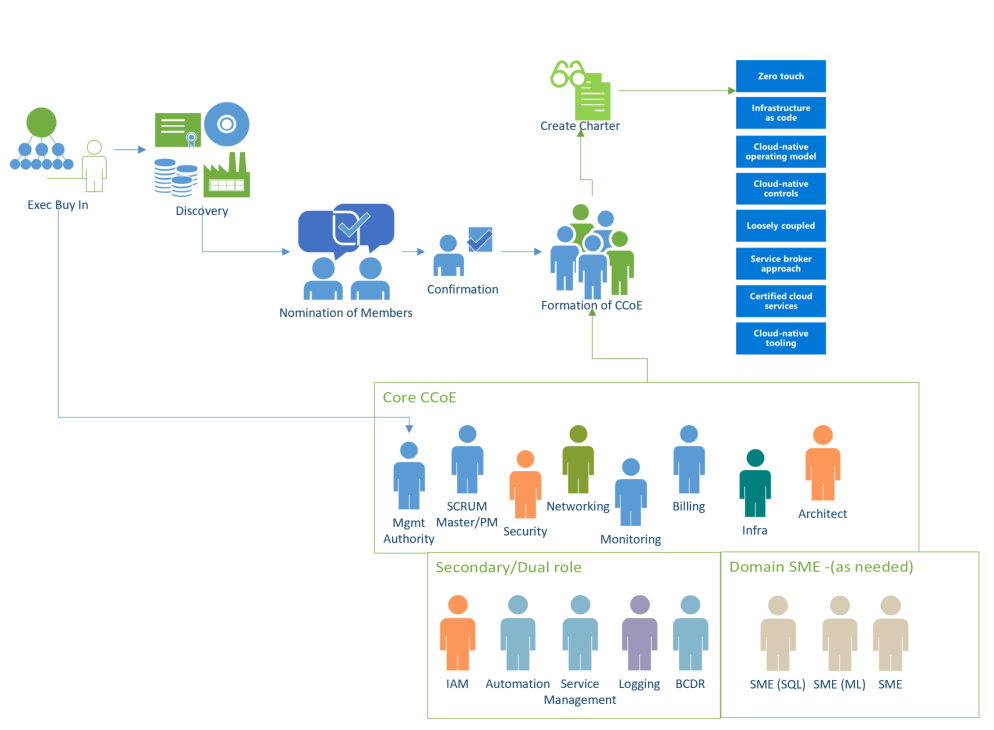

Governance for Speed and Scale
==============================

Contents:
---------

-   [Executive sponsorship](#executive-sponsorship)

-   [General approach](#general-approach)

-   [Membership](#membership)

-   [Commitment and expectations](#commitment-and-expectations)

-   [Charter](#charter)

-   [Training and Education](#training-and-education)

Customizing this approach
-------------------------

This document describes the formation of various governance bodies. This
guidance should be thought of as a generic proposal and not a one-size-fits-all
design. The size of your organization, leadership maturity and how overall teams 
are structured should be taken into account when implementing these ideas. 
Feel free to customize this approach as needed if the approach you take produces 
the desired results. The details listed here is available for those organizations 
looking for a place to start.

It’s Culture not Cloud
----------------------
We've all heard the old adage, "Culture eats strategy for breakfast." 
Organizations only achieve their mission, goals, and objectives if 
they live an execution culture. 

There are go-to business books, like Execution: The Discipline of Getting 
Things Done (2002), that highlight the core methods for achieving success for 
"the people, the strategy, and the operational processes." There are also many 
case studies and success stories highlight similarities in driving for success; 
understanding the critical success factors for Rhythm of Business and executive 
sponsorship or senior leaders as the process owners themselves - to ensure that 
strategy accounts for reality. 
-Discipline
-Alignment
-Momentum before Maturity
-Ownership & Intensity

Similar references are easy to find in Leading Change by John Kotter, highlighting 
core principles in “Establishing a Sense of Urgency.” Most especially note 
the reference of change agents ratio to organization size (10:100 for significant change;
15K+:100K to product significant change). Manyreferences have highlighted what most 
should already intuitively know:
-starting the change is easy
-growing the change is complex and often wrought with unforeseen difficulties
-and it is most difficult to sustain change over any extended period of time

### Critical Success Factors

#### Leveraging your enablers
Challenge existing systems
Align with the like-minded
Be prepared for conflict

Often times, the opportunity to accelerate seems counterintuitive. 
Cultural Transformation is driven by prioritization & focus. To be effective, 
CCoE has to be supported both top-down and bottom-up in a predictable Rhythm 
of Business. CCoE requires constant support for alignment and authority to get 
out of “project purgatory” or a state at which "too Much WIP rarely delivers anything."
-Top-down Support - CCoE stays focused top-down from a strategic Horizon view and 
prioritized Direction from the executive level.
-Bottom-up Support - CCoE partners with Program Mgmt for aligning day-to-day and 
month-to-month efforts on a track for benefits realization expected from top-down
funding & sponsorship.

CCoE is empowered with Program Management to drive cross-functional outcomes 
on a steady Rhythm. It may seem like it’s more complicated to be adding in 
layers, or adding in people, but it’s what allows things to flow. Getting to a 
predictable rhythm of alignment & execution is what makes delivery smooth
and you must be smooth in order to go fast. 

#### Realizing Benefits
Create a system of accountability
Remove Blockers
Leverage Experts

"PMI has conducted the Pulse study since 2006 to provide evidence that 
implementing strategy successfully is inextricably linked to an organization’s 
capability to deliver successful projects and programs.” – High Cost of Low 
Performance, Pulse of the Profession 2016, Project Management Institute. 

While this go-to industry standard & publication offers data to backup the 
importance of transformation & achieving success, they focus on more than project 
& program management. Other case studies and success stories highlight similarities 
in driving for success, understanding the critical success factors for success 
beyond technical capabilities and criticality of sponsorship. Solid sponsorship 
and solid program ownership offer:
-higher alignment to strategic intent
-higher probability of benefits realization
-recognizable increases in productivity through predictability
-accountability to leadership and business management skills

#### Driving Self-reliance
Empower Teams
Educate Everyone
Create a culture of execution

Rhythm of Business must be strong enough to ensure benefits realization 
and help ensure top-quality delivery of each program’s collective projects
CCoE & PrgMgmt are Critical Success Factors in & of themselves. Cultural 
transformation is just as important as the technical transformations, and 
in some cases even more so to drive benefits realization. Attaining business 
agility comes from the ultimate construct that is put in place to accelerate 
your transformation – and this construct is through predictability & focus on 
adding value fast.

Executive sponsorship
---------------------

Before you undertake the AGF or the formation of a CCoE is it imperative that
you have an executive sponsor. This approach is forward-looking and disruptive
to the way IT organizations have been run historically. You should expect to
encounter resistance, either to cloud in general or this approach in particular
(typically arguing instead for the “Extend the DC” model described in the [AGF
Introduction](https://github.com/gosson/azure-governance-foundations/blob/master/AGF/100-AGF%20Introduction.md)).
Ideally your sponsor should be a C-level executive (CIO, CTO, etc.) and one who
shares the vision of modernizing IT and evolving it from a technology broker to
a business partner. Again, depending on the size and complexity of your
organization, this may not be feasible but secure a sponsor with as much power
and authority as possible. Their endorsement will facilitate the creation of
these groups and provide a mantel of authority under which they will operate.

Once your sponsor has been identified, they should nominate someone to head the
CCoE (as they will probably not have the time to do this themselves). This
person will be charged with the actual creation of the groups, nomination of
membership and general day-today activities. They will also bring the sponsor in
when organizational roadblocks occur at least until such a time as the charter,
direction and endorsement of the CCoE is widely understood within the
organization.

General approach
----------------

At its core, the CCoE can be thought of as a parliamentary system with multiple
assemblies (technically a multicameral governing body) in which each assembly
(or committee) represents an aspect of the technology transformation: Platform,
Security, Monitoring, etc. and is responsible for governing that aspect. The
committees control their own destiny with respect to their areas but require
consensus on matters that affect other committees for the CCoE as whole. A
committee brings their proposal to the full CCoE to be discussed and ultimately
ratified. If during this discussion, it becomes clear that the policy will
affect other committees, the affected committees should come to an agreement. If
they cannot, the full CCoE may vote on such matters.

Below are a few examples to help clarify this approach:

#### Example 1:

The Monitoring committee submits a policy where every new container that is
deployed must have logging enabled and be configured to send those logs to a
specified workspace so that it can be viewed by Azure Monitor. During
discussion, a representative from the Architecture asks if the current
architecture design for Azure Kubernetes Service needs to be modified to
accommodate this change. The Monitoring committee explains that the policy will
automatically be applied to new containers without any changes to the design and
that existing containers can be updated with a simple script generated by the
policy engine. The Architecture team having been satisfied that they are
unaffected has no objection to the policy.

Because this policy does not affect other committees, the details of the policy
(what amount of logging and where the log go) are solely the purview of the
Monitoring Committee. Nonetheless it is important to submit the policy for
ratification so that the CCoE understands what the policy does and has a chance
to ask questions about it.

#### Example 2:

The Platform committee decides that having a large number of Azure subscriptions
(one for each application) is desirable. When the Platform committee brings that
policy to the full CCoE to be discussed, the Security committee raises a
technical consideration – namely that the current Azure limitation for vnet
peerings is 100. If the organization will have more than 100 subscriptions,
connectivity between subscriptions will need to be addressed differently that
they had planned. Since this policy does affect more than one committee the
committees need to find an amicable resolution or have the entire CCoE vote on
the policy.

In this case during discussion the CCoE determines that there are only 20
applications currently in the plan and that at the rate of growth is will be at
least three years until the organization reaches 100 applications. Given the
expected timeframe the Networking committee withdraws its objection with the
expectation that the technical limit (which has grown over time) is likely to
continue to grow and meet their needs.

If the Networking committee had not withdrawn its objection and was unable to
reach a consensus with the Platform Committee, the CCoE would then vote of the
matter with each member weighing the merits and risks of the policy.

Membership
----------

The CCoE, as a whole, is composed of the person nominated by the executive
sponsor (Mgmt Authority in the diagram below) acting as chair, a SCRUM master or
program manager and a representative from each committee.

Each committee must contain at least one member (but generally not more than
six). Some committees can share memberships where appropriate. For example, a
member of the Security committee would also be at home as a member of the
product Catalog committee (since the certification of products in the catalog
has a security element). This might also be a necessity if the number or
resources that can be dedicated to CCoE work is minimal

There should also be at least one project manager (or SCRUM manager) for each
committee as well as the CCoE. The same PM can manage the responsibility across
multiple committees if time/resourcing permits.

NOTE: In larger organizations the creation of a Project Management Committee
would not be out of place.

In a smaller organization with resource constraints the CCoE might be as small
as six people (four committees of one plus the PM and a chairperson. A CCoE
smaller than this is discouraged as it is likely too daunting and demanding for
those resources.

Commitment and expectations
---------------------------
Effectiveness is a Habit = Practices + Concentrated Time (Small daily habits) 
+ Excellent Time Management (Focus)

If you don't like this outline, pull any other busines book off the shelf 
to land the point - you are what you repeatedly do, so learn how to 
be effective. Construct is meant to provide fluidity and does not 
have to be overly bureaucratic. Don't get in your own way by morphing it
into something it shouldn't be, especially when stakeholders believe that 
they should be involved or deciding things when they shouldn't. You can 
read further with publications like these:
-Agile Portfolio Management and Agile Practices Guide  – PMI
-Governance rules! The principles of effective project governance – 
Eamonn V Kelly
-Why Strategy Execution Unravels—and What to Do About It – HBR Donal Sull, 
Rebecca Homkes, Charles Sull
-Execution – Larry Bossidy, Ram Charan

### Rhythm of the Business

Ultimately, there must be a construct to leverage enablers, realize benefits,
and drive self-reliance in order to scale.

Executive Leadership Sets the Horizon View
-Breaking down the 3-to-5yr Strategic Plan into 18mth Increments 
-Mapping general goals to funding, business statuses, & sales pipeline

Steering Committee Aligns Direction on Portfolio Strategy & 
Prioritizes New Discoveries
-Breaking down the 18mth Increments into 6-12mth Priorities 
-Defining unit/product-line goals and core metrics that the company 
is capable of tracking

Cloud Center of Excellence Sponsors Roadmap for Architectural Alignment
-Breaking down the Semi-annual Increments into Quarterly Priorities  
-Aligning Value of investments based upon market & quickest 
delivery/launch opportunities

Program Management Drives Benefits Realization & Aligns to 
Strategic Priorities
-Breaking down the Quarterly Priorities into Project Investments 
with CCoE
-Teams across the business should be aligned for time & ownership 
to simplify stories/iteration deliveries

Project Management & Operational Leadership Deliver Program 
Benefits Incrementally
-Breaking down the Individual Projects to 30/60/90-day Deliverables 
-Each person outlines efforts & deliverables for 7-8 days “heads down” 
into 2-3 days “checking & adjusting” to reach a tangible result for their customer(s)

Self-Organizing Teams Deliver
-Breaking down the Individual Projects to 30/60/90-day Deliverables 
-Communication & visibility is required to overcome obstacles with reaching 
a definition of “done-done” on whatever the end goal is intended to be 
to meet the highest priority of satisfying our customer(s)

### Program and Project Management
Leader assignments must be mapped to acceptable levels of complexity, where 
Program and Project Management do not necessarily have to be official titles. 
Apply "complexity thinking" to leadership assignments, the proficiency level 
of project managers and business analysts must be commensurate with the 
complexity of the initiatives prioritizes. In addition to large, highly 
complex projects, strategic level project managers and business analysts 
also are needed to manage programs (a group of projects managed in a 
coordinated way to obtain greater benefits) and portfolios (a collection of
projects or programs managed together to achieve strategic goals).

What do they do first?
Make sure they've got their program elevator pitch
-Establish the basics on the goals mapped to Investment Canvas/Vision
-Why is it important and how do tranches initially correspond to priorities
-What is the initial day-to-day approach vs overall program "mechanics"
-How do priorities align across programs vs CCoE as expected "deliveries"
-Initialize line of sight for alignment via key artifacts & methods

Ensure that the CCoE is set to move ahead immediately
-Avoid rework (which is different than spiking or refactoring)
-Engage subject matter experts to help avoid delays especially in 
recognizing dependencies
- Achieve final alignment for final CCoE Committees & Staffing
-Communicate/escalate any priorities conflicts
-What are the initial projects for bridging the “Theory/Practice” Gaps
-Establish & communicate expectations for escalations (timely & upward)

### Agility - is it scrum, SaFE, Kanban, all, none?
If you don't know then get a Project, Program, and Portfolio Management Expert.
Most of the time, teams (even highly mature organizations) use hybrid methodologies. 

Adopting only a few techniques (e.g. daily stand-up meeting) ≠ We’re Agile
-Must engage and empower team leaders for grooming the backlogs, recurring prioritization
-Need ongoing education and regular coaching of the “Practicing Mind”
-Avoid Command-and-Control styles
-Need to stop accepting fad words that aren’t translated to a ceremony

Line of Sight between teams through CCoE Architecture & Program Management
-Agile teams do not always have line of site to other teams’ efforts. Utilizing business 
architecture best practices, artifacts produced identify the alignment between 
strategies, initiatives, value delivery perspectives, and shared capabilities, 
which collectively provide this line of sight.
-The owner for an agile team may not see important interrelationships and 
dependencies that are present. Architecture should identify the value streams, 
value stages, and the related business capabilities, allowing easier identification 
of the work efforts that would need to be completed (“epics”). 

Empowering self-organizing teams aside of a strong “Coordinator” day-to-day, 
bringing urgency to individual projects
-Automated, simple information radiators.
-Short iterations with tangible outputs presented publicly.

### From Discovery to Delivery

The

### Escalations

The

### Creating a Culture of Accountability
Deliberate & Communicate - Leverage key BU’s & evangelize portfolio 
missions, especially in  empowering CCoE for technology decisions. 
(e.g. Cloud First, or Cloud before Buy before Build)

Assign Ownership - Decentralize everyday IT & PM functions to allow 
self-organizing teams to accelerate. Prioritize initiatives on strategic 
importance & give to CCoE & Sr PM.

Decide & Advise - Determine investments based upon demand, epic-level 
business cases. Provide direction & support for top management.
Support CCoE Committees and don't "throw a flag on the play" after the 
working session/decision discussion concludes.

Advocate & Resolve - Communicate expectations for visibility. Support 
Program Management to ensure activities provide return. Resolve resource 
allocation issues. Keep rhythm & pace.

### Empowered and self-organizing teams

The

Governing bodies
----------------

### Steering Committee

The Steering Committee must be deliberate, make decisions, advise, provide 
strategic oversight, and to serve as the primary “advocate” for all the
assigned initiatives. When everyone in the organization is going to 
be forced to work in a state where there’s a higher degree of uncertainty, 
there have to be strong leaders at the helm to direct delivery and ensure 
you don’t lose pace on creating innovative solutions quickly.

It's important to recognize that this is a group of people taking a lot 
of inputs and working to translate them to expected value outputs/benefits 
to be realized. Steering Committee membership is often a thankless job, 
carrying much controversy & politicking more often than any other 
navigation requirements. 

So what do they do first?
-Expedite Vision & Value Mapping with current priorities’ expected benefits (Agile Charters or Canvases)
-Funding & Business Case (Epics)
-Scrutinize current works in progress to pace, pivot, or persevere
-Kickoff the teams’ new full-time job with the current #1 priority for “quick wins” the refactor time
-Assign Sr Sponsors, Program Managers, and Day-to-day leadership for teams to self-organize with accountability
-Look at the initial programs to ensure alignment to “quick wins” and build momentum cross-functionally
-Commitment to continuous improvement & operational excellence

Between ELT & CTSC, there is often a "Portfolio Canvas" (to use the SAFe terminology). 
It connects the Value Streams & Solutions to the key business objectives.  
This helps to further streamline downward planning, budgets allocated 
to the value streams, and aligning team communication for aligning everyone’s 
objectives or exchanging new ideas. If you don’t already have these for 
the identified areas, then they should be generated with a knowledgeable 
team & Program/Portfolio lead. (value streams, solutions, customers, 
channels, relationships, budget, kpi’s, partners, activities, resources, 
cost structure, revenue stream). 

In order for CCoE & Program Management to align, the inputs are critical of 
the strategic directions/canvases along with the total budget. They area 
responsible for driving value within the approved budget along with the 
processes for approval of more funding. They have to collaborate and 
understand how much is available for new dev vs. ongoing operations in 
balancing new requests into the queues with the steering committee. 
For SAFe, this is driven through RTE’s & STE’s (Release/Solution Train Engineers). 

In order for Executive Leadership & Steering Committee to connect with 
Program-level actors, Programs have to be lead strongly & boldly with experienced
professionals who are capable of driving both strategic & tactical narrative. 
Neither the Steering Committee nor Program Management are for the faint-at-heart; 
they have to be constantly aligning to estimate, forecast, and refactor using 
program increment or agile techniques to ensure appropriate drive of long-term 
roadmaps in balance with derived value, business strategy, and what must be dealt 
with in other organizations still working toward the changed environment (e.g. traditional budgeting). 

Bridging team
-------------

People managers or key initiative owners may operate as a sponsor for domains,
processes, outcomes, or simply aligned CCoE to the bounds & expectations of the 
Steering Committee. Where an organization is more mature in managing complexity 
with very experienced leaders operating in a desired state of both team & company
culture, it may not be necessary to use a bridge team. In instances of high capability
and high maturity for people management, leadership, and portfolio management, 
it may be best to align to focused project teams vs operational teams to focus the 
people managers as they'll still be required to conform to some sort of portfolio management
strategy and scalable framework for predictability day to day with empowered teams.

Train, Support, Coach with “Hybrid Teams”
-Need to address cultural change to set a truly successful 
transformational path. Redeploy change resisters to get over 
concerns of “losing management control”
-Individuals and interactions matter most especially in areas of 
communication, leadership, and conflict resolution skills

Evangelize the "Difference" Project (Changing the Business) and 
Ops (Running the business) 
–Understanding staffing for parallel paths 
of those who are learning at the same time as doing their old/current jobs

Setting Priority ≠ Work on everything at the same time
-Need to better enforce decision-making criteria at the “input value” 
to determine the true strategic value of any undertaking
-Channeling topics & decisions to appropriate forums

Activity ≠ Progress 
-Need to understand at a gut level the reality and cost of multitasking 
(cost, frustration, defects, & time to market impact enterprises in one single activity)
-Avoid prioritizing processes and forms over delivering value to get the wins EARLY

Assigning Names ≠ Transformation 
-Cloud First – before buying or building, analysis should be performed 
with CCoE in like, grade, partner, pricing
-Avoid myths about individual management teams knowing how to manage projects, 
disaggregate work, or adjust in a vacuum
-Need to promote sustainability & pay continuous attention to technical 
excellence and good design
-Avoid “mini-waterfalls” that kill cross-functional teams & elongate release cycles
-Need to groom the backlog regularly and avoid wasted work mid-sprint

Cloud Center of Excellence
--------------------------

One approach that successful customers have implemented is the creation of a
Cloud Center of Excellence (CCoE). The CCoE is comprised of teams of very
specialized personnel who focus on cloud governance and management. The idea of
a CCoE is one of a modern IT operational model that that follows an agile
approach to capturing business requirements to partner with the business. The
goal of the AGF is to help customers create a functional CCoE that provided
agility, governance and security to the business.

A Cloud Center of Excellence is a group dedicated to maintaining a secure,
compliant and well-governed cloud. The CCoE is made up of representatives from
the areas of the business that are affected by the cloud. Each of the members of
the CCoE are experts in their respective areas both in the on-premise world and
in the cloud. The CCoE is broken up into committees (or team of teams) which
focus on specific areas of the cloud. Typically, these are:

-   Platform governance

-   Security

-   Architecture

-   Monitoring

-   Automation

-   Product Catalog

-   DevOps

-   Data

-   Program Management

Each of these committees are focused on their area and they create the policies
which will ultimately be enforced by the cloud. While the committees control
their own destiny with respect to their area, they do not operate in a vacuum.
As the committees create policies, they submit them back to the larger CCoE for
comments and ratification. In this way, no one group operates without oversight
and policies that are proposed are reviewed for any potential impact upon other
groups or the cloud as a whole (this is imperative as policy decision may have
unintended consequences for other committees).

The CCoE achieves control over the cloud by using cloud-native tools to meet the
organization’s needs. By building a secure framework they can step back and
allow business units to consume the cloud without the same obstacles that the
traditional approach creates.

### Hallmarks of a CCoE

A CCoE will create its own specific charter that will dictate how it operates in
specific but in general terms there are a few common hallmarks of a CCoE model:

-   Service Broker Approach

-   Loosely Coupled Architectures

-   Re-use of certified cloud services

-   Use of Cloud-native tooling

-   Cloud Native Controls

-   Zero touch implementations

-   Infrastructure as code

-   A cloud native operating model

These hallmarks are detailed in the [Building a Cloud Center of
Excellence](https://github.com/gosson/azure-governance-foundations/blob/master/AGF/101-Building-a-Cloud-Center-of-Excellence.md)
guide.

During the initial phases of this approach, expect members to have a full-time
or near-full-time commitment. Between the training needed, research,
experimentation and proposals a great deal of time needs to be invested by
members.

If all members of the CCoE were already considered experts in their respective
areas of cloud, the AGF might be completed in as little as one month. However,
since at least some training and ramp up is typically required a more realistic
timeframe is 90 days.

During this time, the CCoE should meet at least weekly with the intervening time
dedicated to the work of individual committees which may be meeting daily.

After the foundations haven been completed and the platform is ready to accept
workloads (at the completion of the work described in the AGF), the time
commitment may be reduced. The amount of time the CCoE needs to invest will then
be a function of the number of workloads expected and how close the platform
gets to achieving a ‘steady state’.

In smaller organizations in a steady state, committee membership may drop to a
single person with CCoE meeting happening as infrequently as monthly. In large
organizations membership generally continues to be a full-time commitment,
although the size of the committees may shrink.

As the rate of consumption of new cloud services rises within an organization,
the benefits that cloud offers becomes fully realized and IT department’s
transformation from man-in-the-middle acquiring new hardware to a true business
partner enabling their companies to achieve more.

Organizational Change Management
--------------------------------
Often OCM pro's refer back to that which has already survived the tests 
of time with Peter Drucker, then layer on some developments in Behavioral 
Psychology domains along with the grieving process. This is an extremely deep
domain and requires an incredible amount of TLC, so it's highly recommended that
you get someone with a lot of experience in large cultural change because
it takes leadership "grit" that can usually only be learned & re-applied
by those "who've been there and done that" - then paired up as a mentor with 
mentees in hope of accelerating the education curve here too. Get expert help!

Let's just start with Drucker on, “The greatest danger in times of turbulence is not 
the turbulence; it is to act with yesterday’s logic.” Or another one from 
this “Best of”-type of compilation, “Morale in an organization does not mean 
that ‘people get along together’; the test is performance, not conformance” 
– The Essential Drucker: The Best of Sixty Years of Peter Drucker’s Essential 
Writings on Management, Collins, Paperback Business Essential Edition 2008.

While this highly recognized change management guru can be cited on the importance 
of leadership & teamwork, he also carried further insights into the roles people 
play in organizations. Leaders must continue to drive "what must be let go of"
in order to move into the “new,” as well as building on strengths of people and 
teams (bridging as necessary until you’ve got “it”). Success stories continue 
to prove out that solid teamwork and chartered teams/chartered partnership offer:
-Team Empowerment - The knowledge worker is expected to get the right 
things done. Manage incompetence appropriately.
-Insights into Theory of Constraints – looking at anything repetitive (people, 
process, product) as a living entity, and find the bottleneck that is preventing 
maximum output. (CCoE should drive and not be driven, escalating if they’re blocked)
-Importance of prioritization and effective decision-making

Training and Education
----------------------

Please refer to the [Enterprise Learning
Plan](https://github.com/gosson/azure-governance-foundations/blob/master/AGF/102-Enterprise-Learning-Plan.md)
for a detailed sample of the courses, workshop and hacks that are available to
upskill the members of the CCoE. This training document is broken down by
committee for your convenience.
