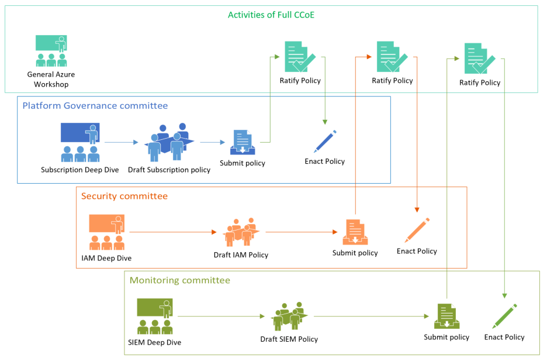
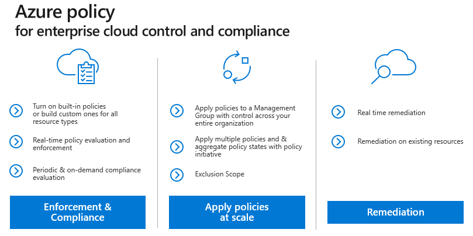

Building a Cloud Center of Excellence
=====================================

Contents:
---------

-   [Executive sponsorship](#executive-sponsorship)

-   [General approach](#general-approach)

-   [Membership](#membership)

-   [Commitment and expectations](#commitment-and-expectations)

-   [Charter](#charter)

-   [Committees](#committees)

    -   [Platform](#platform)

    -   [Security](#security)

    -   [Monitoring](#monitoring)

    -   [Architecture](#architecture)

    -   [Product Catalog](#product-catalog)

    -   [DevOps](#devops)

    -   [Data](#data)

-   [Committee interaction](#committee-interaction)

-   [Azure Policy](#azure-policy)

-   [Training and Education](#training-and-education)

Customizing this approach
-------------------------

This document describes the formation of a CCoE. This guidance should be thought
of as a generic proposal and not a one-size-fits-all design. The size of your
organization and how it is structured should be taken into account when creating
your CCoE. Feel free to customize this approach as needed. Instead of six
committees you may find that breaking up the Security Committee into separate
groups for Identity and Networking makes more sense in your organization - or
you may find that the Automation and Product Catalog Committees should be
merged. These are perfectly acceptable if the approach you take produces the
desired results. The details listed here is available for those organizations
looking for a place to start.

Executive sponsorship
---------------------

Before you undertake the AGF or the formation of a CCoE is it imperative that
you have an executive sponsor. This approach is forward-looking and disruptive
to the way IT organizations have been run historically. You should expect to
encounter resistance, either to cloud in general or this approach in particular
(typically arguing instead for the “Extend the DC” model described in the [AGF
Introduction](https://github.com/gosson/azure-governance-foundations/blob/master/AGF/100-AGF%20Introduction.md)).
Ideally your sponsor should be a C-level executive (CIO, CTO, etc.) and one who
shares the vision of modernizing IT and evolving it from a technology broker to
a business partner. Again, depending on the size and complexity of your
organization, this may not be feasible but secure a sponsor with as much power
and authority as possible. Their endorsement will facilitate the creation of
these groups and provide a mantel of authority under which they will operate.

Once your sponsor has been identified, they should nominate someone to head the
CCoE (as they will probably not have the time to do this themselves). This
person will be charged with the actual creation of the groups, nomination of
membership and general day-today activities. They will also bring the sponsor in
when organizational roadblocks occur at least until such a time as the charter,
direction and endorsement of the CCoE is widely understood within the
organization.

General approach
----------------

At its core, the CCoE can be thought of as a parliamentary system with multiple
assemblies (technically a multicameral governing body) in which each assembly
(or committee) represents an aspect of the technology transformation: Platform,
Security, Monitoring, etc. and is responsible for governing that aspect. The
committees control their own destiny with respect to their areas but require
consensus on matters that affect other committees for the CCoE as whole. A
committee brings their proposal to the full CCoE to be discussed and ultimately
ratified. If during this discussion, it becomes clear that the policy will
affect other committees, the affected committees should come to an agreement. If
they cannot, the full CCoE may vote on such matters.

Below are a few examples to help clarify this approach:

#### Example 1:

The Monitoring committee submits a policy where every new container that is
deployed must have logging enabled and be configured to send those logs to a
specified workspace so that it can be viewed by Azure Monitor. During
discussion, a representative from the Architecture asks if the current
architecture design for Azure Kubernetes Service needs to be modified to
accommodate this change. The Monitoring committee explains that the policy will
automatically be applied to new containers without any changes to the design and
that existing containers can be updated with a simple script generated by the
policy engine. The Architecture team having been satisfied that they are
unaffected has no objection to the policy.

Because this policy does not affect other committees, the details of the policy
(what amount of logging and where the log go) are solely the purview of the
Monitoring Committee. Nonetheless it is important to submit the policy for
ratification so that the CCoE understands what the policy does and has a chance
to ask questions about it.

#### Example 2:

The Platform committee decides that having a large number of Azure subscriptions
(one for each application) is desirable. When the Platform committee brings that
policy to the full CCoE to be discussed, the Security committee raises a
technical consideration – namely that the current Azure limitation for vnet
peerings is 100. If the organization will have more than 100 subscriptions,
connectivity between subscriptions will need to be addressed differently that
they had planned. Since this policy does affect more than one committee the
committees need to find an amicable resolution or have the entire CCoE vote on
the policy.

In this case during discussion the CCoE determines that there are only 20
applications currently in the plan and that at the rate of growth is will be at
least three years until the organization reaches 100 applications. Given the
expected timeframe the Networking committee withdraws its objection with the
expectation that the technical limit (which has grown over time) is likely to
continue to grow and meet their needs.

If the Networking committee had not withdrawn its objection and was unable to
reach a consensus with the Platform Committee, the CCoE would then vote of the
matter with each member weighing the merits and risks of the policy.

Membership
----------

The CCoE, as a whole, is composed of the person nominated by the executive
sponsor (Mgmt Authority in the diagram below) acting as chair, a SCRUM master or
program manager and a representative from each committee.

Each committee must contain at least one member (but generally not more than
six). Some committees can share memberships where appropriate. For example, a
member of the Security committee would also be at home as a member of the
product Catalog committee (since the certification of products in the catalog
has a security element). This might also be a necessity if the number or
resources that can be dedicated to CCoE work is minimal

There should also be at least one project manager (or SCRUM manager) for each
committee as well as the CCoE. The same PM can manage the responsibility across
multiple committees if time/resourcing permits.

NOTE: In larger organizations the creation of a Project Management Committee
would not be out of place.

In a smaller organization with resource constraints the CCoE might be as small
as six people (four committees of one plus the PM and a chairperson. A CCoE
smaller than this is discouraged as it is likely too daunting and demanding for
those resources.

Commitment and expectations
---------------------------

During the initial phases of this approach, expect members to have a full-time
or near-full-time commitment. Between the training needed, research,
experimentation and proposals a great deal of time needs to be invested by
members.

If all members of the CCoE were already considered experts in their respective
areas of cloud, the AGF might be completed in as little as one month. However,
since at least some training and ramp up is typically required a more realistic
timeframe is 90 days.

During this time, the CCoE should meet at least weekly with the intervening time
dedicated to the work of individual committees which may be meeting daily.

After the foundations haven been completed and the platform is ready to accept
workloads (at the completion of the work described in the AGF), the time
commitment may be reduced. The amount of time the CCoE needs to invest will then
be a function of the number of workloads expected and how close the platform
gets to achieving a ‘steady state’.

In smaller organizations in a steady state, committee membership may drop to a
single person with CCoE meeting happening as infrequently as monthly. In large
organizations membership generally continues to be a full-time commitment,
although the size of the committees may shrink.

Charter
-------

A CCoE will create its own specific charter that will dictate how it operate.
You can refer to [Robert’s Rules of Order](http://robertsrules.com/) if you need
guidance on specific aspects of parliamentary procedure, meeting rules and the
like. In addition to any operational details, the CCoE should craft a statement
of purpose, outline goals and commit to some principals. These details are
naturally dependent on the organization’s perspective and goals but in general
terms there are a few common hallmarks of a CCoE model:

-   A cloud native operating model

-   Infrastructure as code

-   Use of Cloud-native tooling

-   Cloud Native Controls

-   Loosely Coupled Architectures

-   Re-use of certified cloud services

-   Zero touch implementations

-   Service Broker Approach

Feel free to use as few or as many of these examples as you wish.

Committees
----------

Below is a list of the committees generally found in a CCoE. You can choose to
consolidate or split some of these as need dictate in your organization. Take
care not to reduce the number of committees below three or increase them to more
than nine. Too few or too many committees are likely to cause issues and this
approach may not be effective.

### Platform

-   Build and maintains the Azure platform (within scope of platform topics)

-   Provides subscription governance and hierarchy

-   Defines naming standards and resource tagging requirements

-   Set billing requirements for subscription models

-   Implement Azure Cost Management

-   Create Azure Budgets and Actions Groups

-   Create governance policies

Read more about the [Platform
committee.](https://github.com/gosson/azure-governance-foundations/blob/master/AGF/200-Platform-Committee.md)

### Security

-   Owns sign-on strategy

-   Defines identity provider(s)

-   Defines RBAC controls

-   Define networking architecture for cloud

-   Set policy and guidance for vnets, UDRs, peering, endpoints and NSGs

-   Create connectivity from on-premises to cloud using VPNs or ExpressRoute

-   Owns development of security frameworks, controls, and procedures

-   Provides security and risk controls for workloads

-   Creates security policies, JIT access and adaptive application controls

Read more about the [Security
committee.](https://github.com/gosson/azure-governance-foundations/blob/master/AGF/201-Security-Committee.md)

### Monitoring

-   Collects and analyzes telemetry on the activities, performance metrics,
    health and availability of the services and tooling

-   Provides deep application and infrastructure monitoring.

-   Selects monitoring tools

-   Creates integrated to existing SIEMs if needed

Read more about the [Monitoring
committee.](https://github.com/gosson/azure-governance-foundations/blob/master/AGF/202-Monitoring-Committee.md)

### Architecture

-   Sets and implements policy regarding Business Continuity

-   Sets and implements policy regarding Backup and Recovery

-   Provides architectural guidance/references for certified products (in
    Product Catalog)

-   Creates blueprints for certified products (in Product Catalog)

Read more about the [Architecture
committee.](https://github.com/gosson/azure-governance-foundations/blob/master/AGF/203-Architecture-Committee.md)

### Product Catalog

-   Certifies Azure products for use in customer’s catalog

-   Defines and owns product catalog

-   Build and maintain product deployment packages (ARM)

Read more about the [Product Catalog
committee.](https://github.com/gosson/azure-governance-foundations/blob/master/AGF/204-Product-Catalog-Committee.md)

### DevOps

-   Sets automation strategy and policy

-   Defines Continuous Integration, Continuous Delivery (CI/CD) strategy and
    pipeline

-   Certifies automation tools as fit for use for products in the Product
    Catalog

-   Defines CI/CD code repository

Read more about the [DevOps committee.](205-DevOps-Committee.md)

### Data

-   S.

-   Read more about the [Data committee.](206-Data-Committee.md)

Note: Depending on the size, complexity and structure of the customer, there may
not be a need for a separate Monitoring, Automation or Product Catalog
committee. In such cases one or more of these committees may be absorbed by
another committee.

Committee interaction
---------------------

The CCoE should operate in such a way that committees are empowered to determine
appropriate policies for themselves. Once these policies have been identified by
a committee, they should be raised to the CCoE to be ratified. While each
committee should determine their own destiny, as it relates to their own
governance and business needs, the complexity of cloud requires a wide exposure
to the CCoE to ensure that the recommendations of the committee do not cause
unintended consequences or affect other committees’ policies.

Once policies are ratified by the CCoE they will be implemented by the
recommending committee or the Platform committee, typically in the form of Azure
Policies or Azure Blueprints.

Azure Policy
------------

It is worth mentioning at this point that the term policy is used a great deal
with the AGF and that it might mean one of two things. When the term “policy” is
used, it is referring to the traditional definition “a deliberate system of
principles to guide decisions and achieve rational outcomes”. The is obviously
fundamental to the AGF model in general. But we need to differentiate that from
“Azure Policy” (or Policy) which is a feature in Azure that provides active
controls and governance at scale for your Azure resources. Azure Policies help
you enforce policies and audit compliance as well as monitoring your compliance
state continuously.

Azure Policy is a relatively new feature in Azure but an incredibly powerful
one. It allows organizations to enforce different rules and effects over your
resources, so those resources stay compliant with your corporate standards and
service level agreements.

To clarify, the Monitoring Committee might draft a policy for the required
retention for diagnostics logs for submission to the CCoE. Once approved, (and
as this policy does not affect other committees, it should be approved) the
Monitoring committee will translate that policy into an Azure Policy and enable
that Policy within the organizations Azure subscriptions.

Azure Policies are created using a Policy definition, which is a JSON document
that describes the conditions, category and effects of the Policy. The Policy
definition is applied to a given scope within Azure, either a management group,
subscription or resource group.

While there are currently no specific training courses available, training in
Azure Policy is of paramount importance to the members of committees since it is
the mechanism for turning the abstract policy into a literal enforcement
mechanism.

Until a course is created for this content, please refer to the [Azure Policy
Documentation](https://docs.microsoft.com/en-us/azure/governance/policy/).

Training and Education
----------------------

Please refer to the [Enterprise Learning
Plan](https://github.com/gosson/azure-governance-foundations/blob/master/AGF/102-Enterprise-Learning-Plan.md)
for a detailed sample of the courses, workshop and hacks that are available to
upskill the members of the CCoE. This training document is broken down by
committee for your convenience.

Where do I go from here?
------------------------

As you begin on the journey of governance there are a few topics which need to
be address before any others. The decisions made in these areas will dictate
much of what will follow and so you are urged to consider addressing these
topics as early as possible after your CCoE is formed:

### Identity

-   Will your organization use (or continue to use) Active Directory? or another
    identity provider like Ping, or Okta?

-   If you have on-premise identity solution today will you federate it with
    AAD? If so will you sync password hashes?

-   Will you use Single Sign-on?

>   Give this topic its due respect. Remember: Identity is the new security
>   perimeter.

### Subscription Model

-   How will your organization structure its subscriptions in Azure?

-   Will you try and map to an existing business structure for subsidiaries?

-   How does the accounting team expect or need to see spending information?

-   Will you track spending by team/department/business unit? Will you implement
    charge back?

-   Will you have lots of subscriptions or relatively few?

-   Will you use Azure Management Groups to structure your subscriptions?

### Cloud connectivity

-   How will your organization connect to Azure?

-   Will you use ExpressRoute? ExpressRoute requires third-party connectivity
    providers and often considerable lead time.

-   Will there be DMZs?

-   What IP ranges should be used?

-   Will you use a hub and spoke model?

-   Will you implement a shared-services approach?

The items contained above are not comprehensive but are illustrative of the
things you need to address as early as possible in your cloud journey. While
they can be changed later, such changes can be complicated and costly. It is
best to have given these topics the time and attention they demand early on.
Doing so and planning for future growth will minimize your risk or potential for
architectural debt. Further, these topics will do well in getting the CCoE
started in its workflow and open the door to a series of next steps and topics
the committees can tackle.
